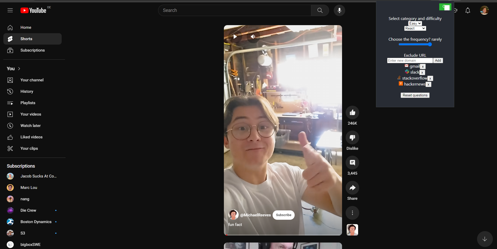
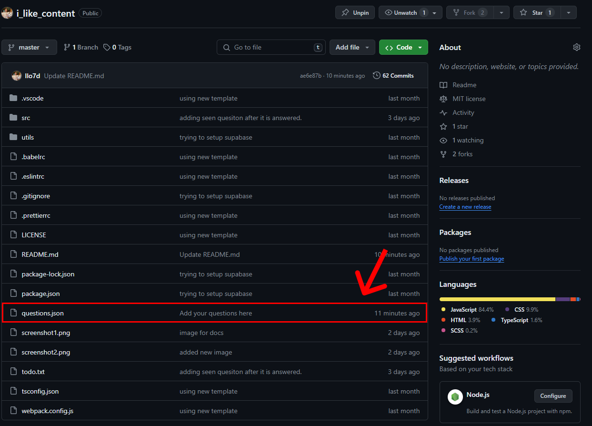

<div align="center">
  <h3 align="center">I like content, but</h3>

  <p align="center">
    A chrome plugin that helps you watch content and learn something while your doing it
    <br />
    <a href="https://youtu.be/dZfTGpOufg0">Watch DevVlog_0 </a>
    ·
    <a href="https://youtu.be/dZfTGpOufg0">DevVlog_1 Comming soon </a>
  </p>
</div>

</br>

<!-- ABOUT THE PROJECT -->
## About The Project


Addictions are good. 

  ```javascript
  Alchacoloc? True
  Cigarets? True
  Crack? True;
  ```

However, the other hard addictions are not.

  ```javascript
  YouTube? false
  TikTok? false
  Twitch? false
  ```


### I need your help
Clone the project and push new questions in the questions.json file.




<!-- GETTING STARTED -->
## Getting Started

### 1. HTML & TailwindCSS

[Dont know how? Learn on YouTube](https://www.youtube.com/results?search_query=how+to+clone+and+commit+new+changes+in+github) 

Keep the json of questions in this format:

```json
Here goes your json object definition
```
</br>


